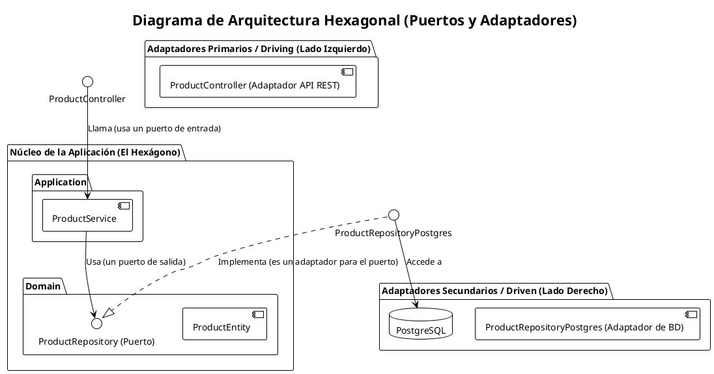

# Proyecto de Arquitectura de Aplicaciones Web

Proyecto base para la materia de Arquitectura de Aplicaciones Web, implementado con NestJS, TypeScript y una arquitectura limpia por capas.

## Arquitectura Hexagonal (Puertos y Adaptadores)

Tienes toda la razón. La estructura de este proyecto sigue el patrón de **Arquitectura Hexagonal** (o **Puertos y Adaptadores**). Este enfoque tiene como objetivo aislar la lógica de negocio principal de los detalles externos como la base de datos, la interfaz de usuario o las API de terceros.

-   **Núcleo del Hexágono (`/domain` y `/application`)**: Contiene la lógica de negocio pura (entidades, casos de uso). No depende de nada externo.
-   **Puertos (`/domain/*.repository.ts`)**: Son las interfaces definidas en el núcleo que describen cómo la aplicación se comunica con el exterior (por ejemplo, `ProductRepository`). Son agnósticos a la tecnología.
-   **Adaptadores (`/api` y `/infrastructure`)**: Son las implementaciones concretas de los puertos.
    -   **Adaptadores Primarios (Driving)**: Impulsan la aplicación. El `ProductController` es un adaptador que expone la lógica de negocio a través de una API REST.
    -   **Adaptadores Secundarios (Driven)**: Son impulsados por la aplicación. `ProductRepositoryPostgres` es un adaptador que implementa un puerto de repositorio para persistir datos en PostgreSQL.

### Diagrama de Arquitectura



## Requisitos Previos

-   Node.js (v18 o superior)
-   npm / yarn / pnpm
-   Docker (opcional, para levantar la base de datos)

## Instalación

1.  Clona el repositorio:
    ```bash
    git clone <URL_DEL_REPOSITORIO>
    ```

2.  Navega al directorio del proyecto:
    ```bash
    cd poli-arq-apps-web
    ```

3.  Instala las dependencias:
    ```bash
    npm install
    ```

## Variables de Entorno

Para correr la aplicación, necesitas configurar las variables de entorno para la conexión a la base de datos. Crea un archivo `.env` en la raíz del proyecto a partir del siguiente ejemplo:

**`.env.example`**

```
# PostgreSQL Database
DB_HOST=localhost
DB_PORT=5432
DB_USERNAME=postgres
DB_PASSWORD=admin
DB_NAME=mydatabase
```

## Ejecución de la Aplicación

```bash
# Modo desarrollo con auto-recarga
npm run start:dev

# Modo producción
npm run start:prod

# Build de producción
npm run build
```

## Pruebas

```bash
# Correr pruebas unitarias y de integración
npm run test

# Correr pruebas unitarias en modo watch
npm run test:watch

# Correr pruebas End-to-End (e2e)
npm run test:e2e

# Generar reporte de cobertura de pruebas
npm run test:cov
```

## Linting y Formato

```bash
# Correr ESLint y arreglar problemas automáticamente
npm run lint

# Formatear el código con Prettier
npm run format
```